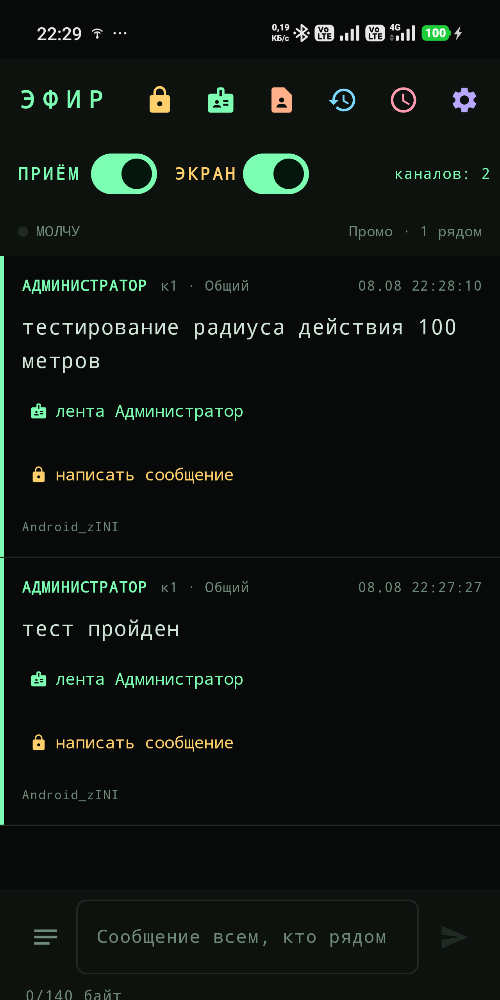
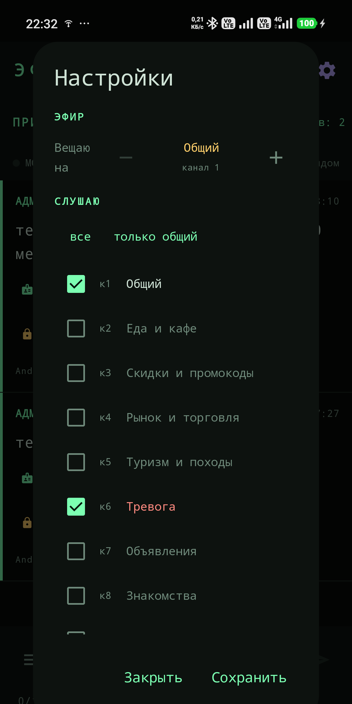
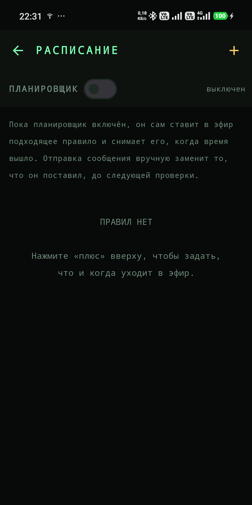
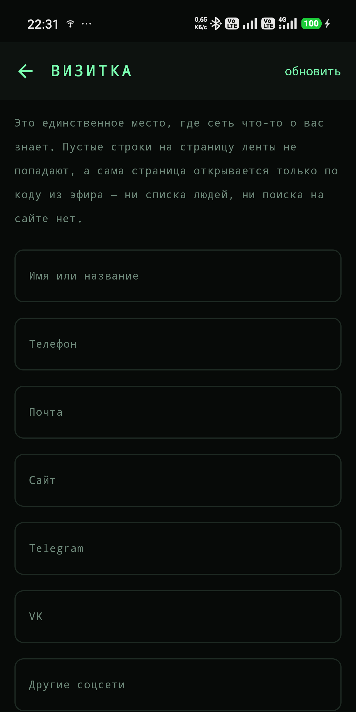

# ЭФИР — радиоинформатор без интернета

[](https://github.com/ignisdomini/wifi-Broadcaster/actions/workflows/android.yml)
[](LICENSE)
[](https://www.rustore.ru/catalog/app/ru.radioinformator.efir)

**Объявление слышат те, кто рядом прямо сейчас. Без интернета, вышек и SIM-карты.**

> *Broadcast to your neighbours over Wi-Fi Direct — no internet, no cell
> towers, no pairing. An Android app that turns a phone into a tiny radio
> station: a short message is carried inside a Wi-Fi service advertisement and
> read by anyone within range. Interface and documentation are in Russian.*

Телефон превращается в маленькую радиостанцию: короткая строка расходится по
всем устройствам в радиусе Wi-Fi через обнаружение служб Wi-Fi Direct.
`WifiP2pManager.connect()` не вызывается нигде в коде — устройства не образуют
пару и не соединяются, сообщение едет внутри самого радиообъявления.

Кафе объявляет обед, рынок — привоз, туристы находят друг друга там, где связи
нет вовсе, а тревожный канал работает, когда молчат вышки.

| | |
|---|---|
| **Установить** | [RuStore](https://www.rustore.ru/catalog/app/ru.radioinformator.efir) · [APK с сайта](https://radioinformator.ru) |
| **Сеть** | [radioinformator.ru](https://radioinformator.ru) |
| **Android** | 5.0 и новее (minSdk 21), около 11 МБ |
| **Цена** | бесплатно, без рекламы и покупок |

<p>
  
  
  
  
</p>

## Что в репозитории

| Папка | Что это | Подробности |
|---|---|---|
| [`android/`](android) | Приложение под Android. Kotlin, Jetpack Compose, Wi-Fi P2P | [README](android/README.md) |
| [`site/`](site) | Сеть: личные ленты, витрина, админка. Чистый PHP 8 + MySQL | [README](site/README.md) |
| [`promo/`](promo) | Пять промо-одностраничников под доменные имена | [README](promo/README.md) |

Три части независимы. Приложение работает без сайта: обмен сообщениями идёт
мимо любого сервера, напрямую между телефонами. Сайт нужен только для
необязательной ленты — длинный текст ложится туда, а в эфир уходит короткий
код страницы.

## Собрать приложение

```bash
git clone https://github.com/ignisdomini/wifi-Broadcaster.git
cd wifi-Broadcaster/android
./gradlew assembleDebug
```

Нужен JDK 17 и Android SDK; путь к SDK указывается в `local.properties`
(`sdk.dir=...`) — он в репозиторий не входит. Тесты гоняются без устройства и
эмулятора:

```bash
./gradlew testDebugUnitTest
```

Для подписанного релиза скопируйте `keystore.properties.example` в
`keystore.properties` и укажите свой ключ. **Ключ от сборки в магазине здесь не
лежит и лежать не будет** — иначе кто угодно выпустит обновление, которое
телефоны примут как настоящее. Без файла release просто соберётся
неподписанным.

## Поднять сеть у себя

```bash
cd site
php -S 127.0.0.1:8831 -t . router.php
```

На хостинге: распаковать в корень домена, открыть `/install.php`, ответить на
вопросы про базу и пароль администратора, затем удалить `install.php`.
Подробно — в [INSTALL.txt](site/INSTALL.txt).

## Как это работает в двух абзацах

Обнаружение служб Wi-Fi P2P (DNS-SD поверх кадров действий) позволяет
устройству ответить на запрос записью службы **до** того, как образована
какая-либо группа. В ответе едет TXT-запись — произвольная карта
«ключ-значение». Сообщение живёт прямо в ней: текст, позывной, канал, время,
публичный ключ отправителя.

Личные сообщения объявляются отдельной службой и шифруются на устройстве
(X25519 + ChaCha20-Poly1305). Ключ выводится из позывного и кодового слова, на
сервер не попадает ни он, ни сама переписка. Подробный разбор формата,
ограничений схемы и найденных на живом железе граблей — в
[README приложения](android/README.md).

## Честно о пределах

- **Дальность — это дальность Wi-Fi:** десятки метров в помещении, до сотни на
  открытом месте. Дальше вас просто не слышно, и в этом замысел.
- **Подтверждения доставки нет.** Адресат должен слушать эфир в тот момент,
  когда сообщение висит в воздухе.
- **Забытое кодовое слово не восстанавливается** никем: на сервере его нет,
  только необратимый отпечаток.
- **Прямой секретности нет.** Кто узнает кодовое слово, прочитает и старые
  записки, если успел записать их из эфира.

## Лицензия

Apache License 2.0 — см. [LICENSE](LICENSE) и [NOTICE](NOTICE).

Об уязвимостях — [SECURITY.md](SECURITY.md), пожалуйста, не публичной задачей.
История версий — [CHANGELOG.md](CHANGELOG.md).
